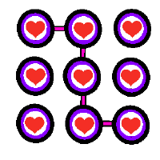

## Welcome to Simp Labs!

Simp Labs is a multi subject matter company, split into Simp Labs Research, and Simp Labs Studios
Maintained by Julian Herrera

### About Our Staff!

#### Julian Herrera(CEO)

I'm Julian Herrera, A 14 year old focused on Writing, Coding, and Machine Learning. I've been coding python for 2 years, and have been working with ML for a  
couple months. I'm looking to colaborate with other grassroots efforts, and with other people interested in helping me with my work. I'm also love obsessed.

### About Simp Labs Research

Simp Labs Research does AI and Machine Learning research, we study how to better analyze surveys, how to use language models in romance based affars and many more unique use cases for Machine Learning.

### About Simp Labs Studios

We make use of people to make great stories, art, and animations, all accelated with Machine Learning! 

### Completed Work

Julian has four completed works
The first one is known as Karlee-Sim a mess of a 2d Dating Sim Julian wasn't very proud of.
It can be accessed [here](https://puffy310.itch.io/karleesim)  
The next two were unprofessional papers, so don't take them as real research.
They are [here](https://drive.google.com/drive/folders/1F_J1HhhuNlgZtEB1eWXuzgYe1rejPW3F?usp=sharing)  
My most recent paper is [here](https://openreview.net/forum?id=CxMuhSuXIW) based on data privacy in nlp. Special thanks to David Bernal!  

### Support or Contact

You can contact Julian Herrera(CEO) at his [Gmail](mailto:blueyboi123@gmail.com) or at my discord:Puffy Avocado#7496
